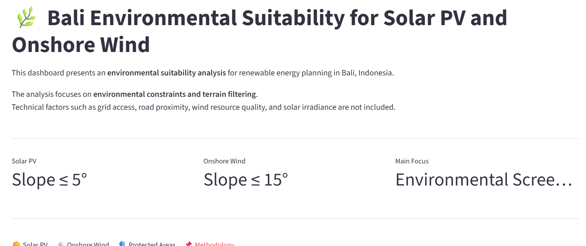
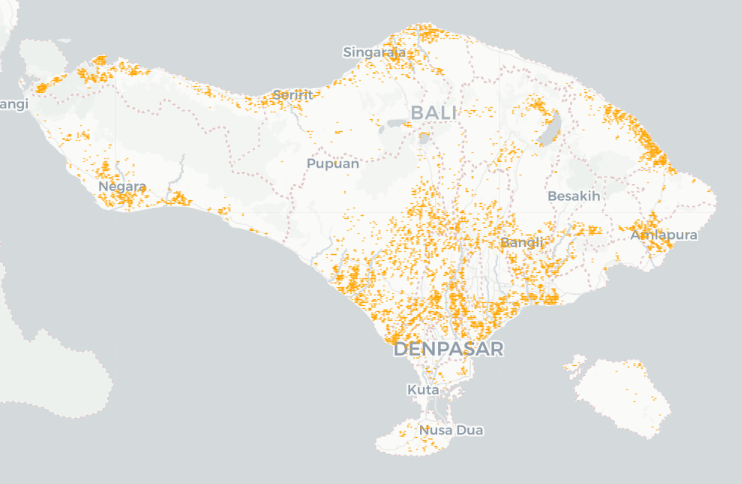
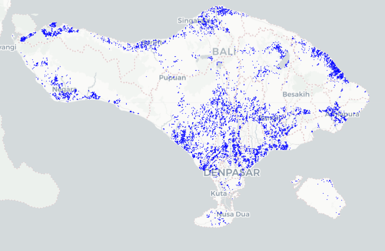

## Methodology

### Environmental Suitability Focus

This project presents an **environmental suitability analysis**, not a full technical site selection.

The objective is to identify areas that are environmentally acceptable for renewable energy development before applying detailed technical and economic criteria.

---
## Dashboard Preview

### Solar PV

### Onshore Wind

### 1. Base Land Preparation

Land suitability was derived from the **ESA WorldCover (2021) raster dataset**, which was reclassified into suitable and non-suitable land cover classes.

**Suitable land cover included:**
- Tree cover  
- Shrubland  
- Grassland  
- Built-up areas  
- Bare land  

**Excluded land cover:**
- Cropland  
- Permanent water bodies  
- Wetlands  
- Mangroves  

The suitable classes were extracted and converted into polygon format to form the base layer.

---

### 2. Environmental Constraints (Exclusion Zones)

Environmentally and culturally sensitive areas were removed using the following constraints:

- Protected areas (WDPA)

- **Temple protection buffers based on Balinese regulations:**
  - **Pura Sad Kahyangan (6 main sacred temples):** 5 km buffer  
  - **Pura Dang Kahyangan:** 2 km buffer  

- River buffer zones  
- Coastal buffer zones  

All constraint layers were merged and used to remove restricted areas from the base layer using spatial selection.

---

### 3. Terrain Filtering

Slope constraints were applied to ensure basic terrain feasibility:

- Solar PV: slope ≤ 5°  
- Onshore Wind: slope ≤ 15°  

---

### 4. Post-processing

To ensure practical usability, very small fragmented areas were removed.

- Only areas **greater than 0.5 hectares** were retained  
- This step eliminates isolated or non-developable land patches  

---

### 5. Final Output

The final outputs represent areas that are:

- Environmentally acceptable  
- Terrain-feasible  
- Spatially continuous  

---

## Important Note

This analysis represents an **environmental screening stage only**.

Further **technical filtering is required** to identify final project locations, including:

- Grid connection proximity  
- Road and infrastructure access  
- Solar irradiance and wind resource assessment  
- Land ownership and economic feasibility  

Therefore, the results should be interpreted as **potential candidate areas**, not final development sites.